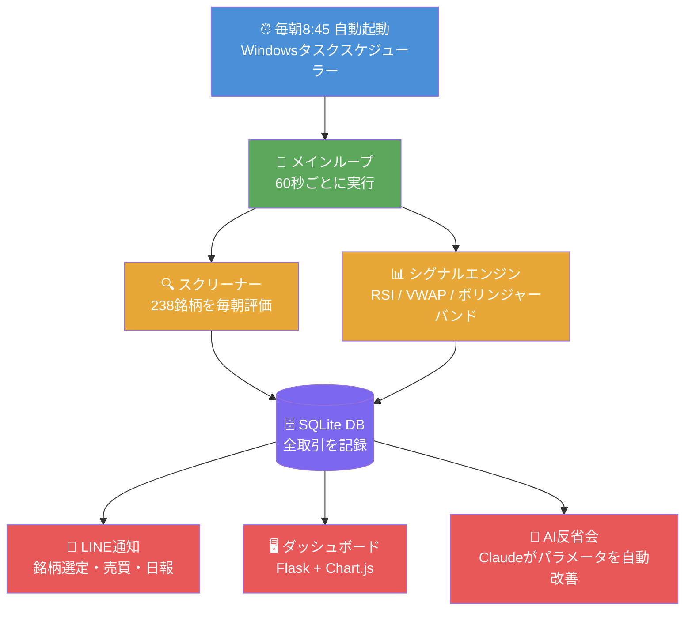
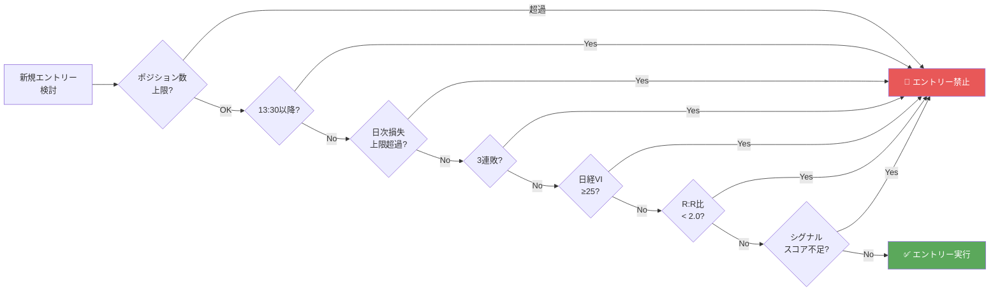

## 突然ですが、お金の話をします

27歳、手取り約25万円の会社員です。

現在の金融資産は **550万円**。すべてNISAで積み立てた投資信託です。目標は **1000万円**。

あと450万円。毎月5万円をNISAに積み立て続けた場合、いつ達成できるか計算してみました。

| 想定リターン | 達成までの期間 |
|------------|--------------|
| 運用益なし（積立のみ） | **約7年半** |
| 年利3%（保守的） | **約5年4ヶ月** |
| 年利5%（オルカン想定） | **約4年6ヶ月** |
| 年利7%（楽観的） | **約4年** |

NISAの積立投資は着実に増えています。でも「もっと早く達成したい」と思ったのが正直なところです。

---

## なぜデイトレードなのか

もともと**スイングトレード（数日〜数週間単位の売買）に興味がありました**。

ただ、会社員として日中フルタイムで働いていると、相場と向き合う時間がまったく取れません。

- 9時〜15時は取引時間だが、仕事中で画面を見られない
- 帰宅してから株価を確認しても、すでに動いた後
- 週末に分析しても、月曜の寄りつきで状況が変わっている

「**時間がないから投資がうまくできない**」というジレンマをずっと感じていました。

そこで考えたのが、**AIにトレードを丸ごと任せる**という発想です。

自分が仕事をしている間も、ボットが9時〜15時をフルに監視して、シグナルが出たら即座に売買する。感情も疲れも関係なく、ルール通りに動き続ける。

「楽をしたい」というのが一番の動機です。正直に言います。

> 「じゃあ、AIに任せてしまおう」

こうして、完全自動のデイトレードボットを作ることにしました。

この記事は、その **全過程をリアルタイムで記録する開発記** です。設計の考え方や実装の工夫、損益も（怖いけど）できる限り公開していきます。

> ⚠️ 投資は自己責任です。この記事は特定の投資を推奨するものではありません。

---

## 「AIに株を任せる」は本当に機能するのか？

正直に言うと、最初は甘く見ていました。

「Claude賢いし、株くらい余裕でしょ」

でも実態は全然違いました。2026年5月時点の最新研究（arXiv 2505.07078）によれば、**LLMを使ったトレードエージェントの多くは、単純なバイアンドホールドにすら勝てない**という結果が出ています。

じゃあなぜ作るのか。

理由は3つです。

| 理由 | 人間 | ボット |
|------|------|------|
| 損切りできる？ | ❌ 含み損を持ち続ける | ✅ 機械的にルール通り |
| 常時監視できる？ | ❌ 仕事中は無理 | ✅ 9時〜15時ずっと動く |
| 記録が残る？ | ❌ 感覚でやりがち | ✅ 全取引をDBに保存 |

「AIが相場を予測して稼ぐ」ではなく、「AIがルールを守って、毎日改善し続ける」という設計思想です。

---

## 使った技術スタック（ほぼ無料）

```
言語:       Python 3.11
価格データ: yfinance（無料・15分遅延）
           kabu STATION API（無料・リアルタイム）
取引API:   kabu STATION API（auカブコム証券）
DB:        SQLite（取引ログ）
通知:      LINE Messaging API（無料）
画面:      Flask + Chart.js（ダッシュボード）
AI:        Anthropic Claude API（毎日の反省会）
OS:        Windows 11（タスクスケジューラーで自動起動）
```

唯一お金がかかるのは **Claude API（1日数円〜数十円程度）** だけ。あとは全部無料です。

---

## システム全体像



---

## 1日の自動動作フロー

PCの電源を入れるだけで、あとは全部自動です。

| 時刻 | 自動で起きること |
|------|----------------|
| 08:45 | ボット自動起動（タスクスケジューラー） |
| 08:50 | 238銘柄をスクリーニング → **LINEに銘柄リスト送信** |
| 09:00〜 | 60秒ごとにシグナル判定・売買実行 |
| 13:30 | 新規エントリー禁止（後場後半は勝率が低いため） |
| 15:00 | 全ポジション強制決済 |
| 15:30 | **日次レポートをLINEに送信** |
| 16:00 | **AI（Claude）が取引を分析してパラメータを自動改善** |

:::message
毎日16時にClaudeが「今日の取引を振り返って、明日のパラメータを修正する」反省会を自動で行います。
:::

---

## リスク管理：7層の防御壁

ボットで一番怖いのは「暴走」です。

なので**7つの条件**に引っかかったらエントリー禁止にしています。



特に以下の3つは、2026年の最新論文を読んで追加した機能です。

- **3連敗ストップ**：感情的になりやすいタイミングで強制停止
- **日経VI（恐怖指数）≥25でゲート**：市場が荒れているときは手を出さない
- **R:R比フィルター**：平均利益が平均損失の2倍未満の銘柄はスキップ

---

## バックテストの結果（先に言います）

5分足データ（直近60日・48銘柄）でのシミュレーション結果です。

| 指標 | 結果 |
|------|------|
| 総取引数 | 1,322回（1日平均22回） |
| 勝率 | **52.1%** |
| ペイオフレシオ | **1.63倍** |
| 累積損益（シミュレーション） | **+2,019,956円** |

:::message alert
これはシミュレーションです。実際の取引ではスリッページや流動性の問題が出ます。過信は禁物。
:::

---

## 現在の状況

今はペーパートレード（模擬取引）で動作確認中です。

1〜2週間でデータが溜まったら、実際の資金（**10万円**）を入れてliveモードに切り替える予定。

その結果もすべてここに書きます。

---

## 次回予告

**#2「238銘柄の中から"今日動く株"を朝8分で見つける方法」**

スクリーニングの仕組みを詳しく解説します。  
引け強さ・3日モメンタム・アキュムレーション・下ひげ反発・日経相対強度の5指標で10点満点のスコアをつけています。

---

*📝 このシリーズは毎週更新予定です。*  
*💬 感想・質問はコメントでどうぞ。*
