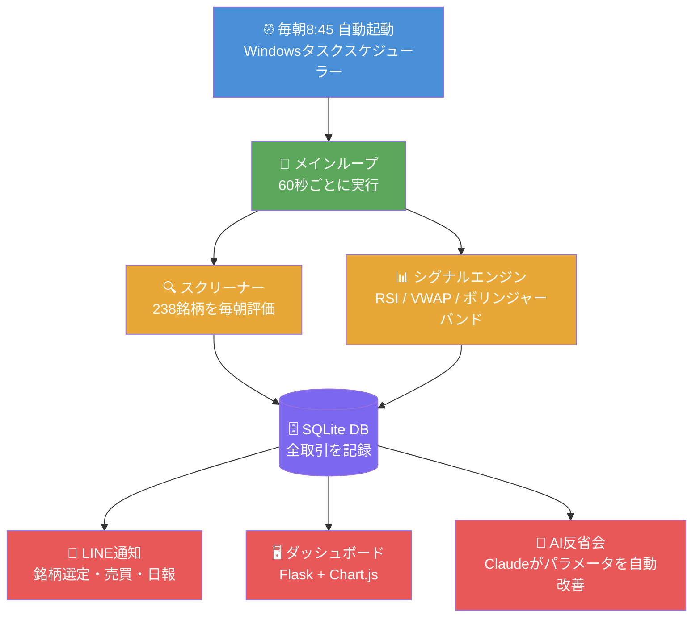
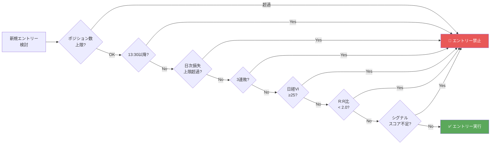

## 前回のおさらい

[#1「給料だけじゃ1000万は無理。だからAIに株を任せることにした」](https://zenn.dev/ryoya_aitech/articles/daytrade-bot-01-intro)では、ボットを作った動機を話しました。

今回は **「どうやって作ったか」** の設計全体を解説します。

---

## 技術スタック（ほぼ無料）

```
言語:       Python 3.11
価格データ: yfinance（無料・15分遅延）
           kabu STATION API（無料・リアルタイム）
取引API:   kabu STATION API（auカブコム証券）
DB:        SQLite（取引ログ）
通知:      LINE Messaging API（無料）
画面:      Flask + Chart.js（ダッシュボード）
AI:        Anthropic Claude API（毎日の反省会）
OS:        Windows 11（タスクスケジューラーで自動起動）
```

唯一コストがかかるのは **Claude API（1日数円〜数十円程度）** だけ。あとは全部無料です。

---

## システム全体像



---

## 1日の自動動作フロー

PCの電源を入れるだけで、あとは全部自動です。

| 時刻 | 自動で起きること |
|------|----------------|
| 08:45 | ボット自動起動（タスクスケジューラー） |
| 08:50 | 238銘柄をスクリーニング → **LINEに銘柄リスト送信** |
| 09:00〜 | 60秒ごとにシグナル判定・売買実行 |
| 13:30 | 新規エントリー禁止（後場後半は勝率が低いため） |
| 15:00 | 全ポジション強制決済 |
| 15:30 | **日次レポートをLINEに送信** |
| 16:00 | **AI（Claude）が取引を分析してパラメータを自動改善** |

### 📱 実際にLINEに届くメッセージ

**① 朝8:50 — 本日の監視銘柄**

```
🔍 本日の監視銘柄 (10銘柄)
  8035 [★★★★☆] 上昇:8/10点
         前日比:+3.8% ATR:4.8%
         理由: 引け強(90%), 3日上昇(+11.6%), 買い集め(vol×2.0), RS強(+9.4%)
  6857 [★★★★☆] 上昇:7/10点
         前日比:+1.4% ATR:4.2%
         理由: 引け強(100%), 3日上昇(+6.9%), 下ひげあり, RS強(+5.4%)
  6920 [★★★☆☆] 上昇:6/10点
         前日比:+2.1% ATR:5.1%
         理由: 3日上昇(+8.2%), 買い集め(vol×1.7), RS強(+3.1%)
  ...
```

**② 取引中 — エントリー・決済通知**

```
[PAPER] 買い: 8035 2株 @ 23,450円 (RSI反発+VWAP上抜け)

[PAPER] ✅ 決済: 8035 2株 @ 24,050円 PnL:+1,200円 (利確)
[PAPER] ✅ 決済: 6857 1株 @ 47,200円 PnL:+8,200円 (利確)
[PAPER] ❌ 決済: 4063 1株 @ 8,920円 PnL:-4,800円 (損切り)
```

**③ 15:30 — 日次レポート**

```
📊 日次レポート 2026-05-10
=========================
取引数: 5回 (勝:3 負:2)
勝率: 60.0%
総損益: +23,500円
PF: 2.31
=========================
  ✅ 8035 売 PnL:+12,400円
  ✅ 6857 売 PnL:+8,200円
  ✅ 6920 売 PnL:+2,900円
  ❌ 4063 売 PnL:-4,800円
  ❌ 7203 売 PnL:-3,200円
```

:::message alert
上記はペーパートレード中のサンプル通知です。実際の運用が始まり次第、本物のスクリーンショットに差し替えます。
:::

---

## リスク管理：7層の防御壁

ボットで一番怖いのは「暴走」です。

なので**7つの条件**に引っかかったらエントリー禁止にしています。



以下の3つは、2026年の最新論文を読んで追加した機能です。

- **3連敗ストップ**：感情的になりやすいタイミングで強制停止
- **日経VI（恐怖指数）≥25でゲート**：市場が荒れているときは手を出さない
- **R:R比フィルター**：平均利益が平均損失の2倍未満の銘柄はスキップ

---

## バックテストの結果

5分足データ（直近60日・48銘柄）でのシミュレーション結果です。

| 指標 | 結果 |
|------|------|
| 総取引数 | 1,322回（1日平均22回） |
| 勝率 | **52.1%** |
| ペイオフレシオ | **1.63倍** |
| 累積損益（シミュレーション） | **+2,019,956円** |

:::message alert
これはシミュレーションです。実際の取引ではスリッページや流動性の問題が出ます。過信は禁物。
:::

---

## 次の記事

https://zenn.dev/ryoya_aitech/articles/daytrade-bot-03-screener

---

*📝 このシリーズは毎週更新予定です。*
*💬 感想・質問はコメントでどうぞ。*
