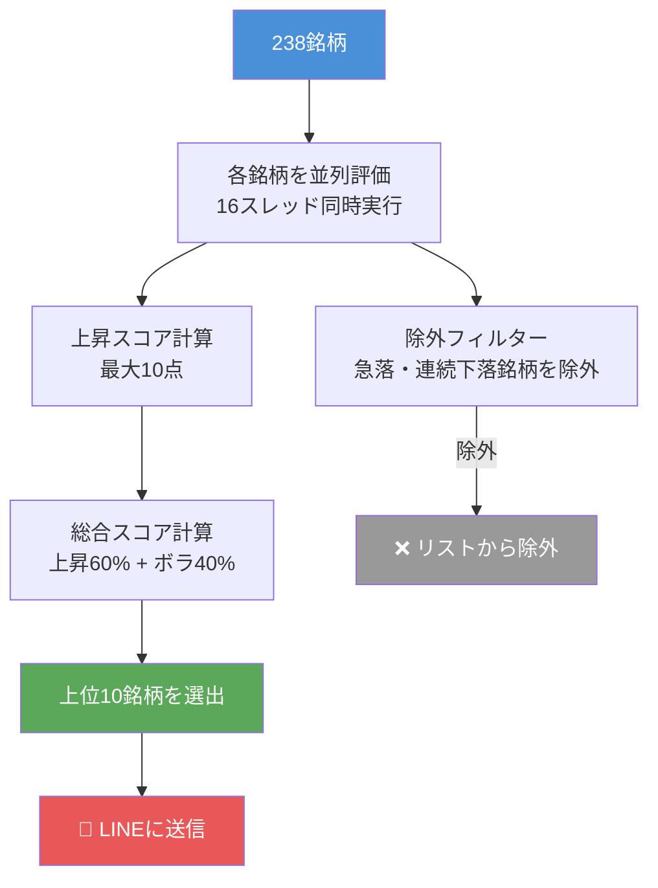

## 前回のおさらい

[#2「Python・LINE・Claudeで作る自動売買ボットの設計図」](https://zenn.dev/ryoya1104/articles/daytrade-bot-02-system)でシステム全体の設計を説明しました。

今回は **「238銘柄からどうやって今日取引する銘柄を選ぶか」** を解説します。

---

## なぜ銘柄選びが一番重要なのか

デイトレードで勝てない人の多くは「シグナル」や「タイミング」にこだわりすぎます。

でも本当に重要なのは **どの銘柄を選ぶか** です。

> 「今日動かない株を、どんなに上手く売買しても意味がない」

毎朝8:50に自動でスクリーニングを実行し、**「今日上がりそうな銘柄」を10件選んでLINEに送信**します。

:::message
スクリーニング実行時間：約8分（238銘柄 × 並列16スレッド）
:::

---

## 対象ユニバース：238銘柄

東証プライムの主要銘柄を業種別にカバーしています。

```python
BASE_UNIVERSE = [
    # 半導体・電子部品
    "8035",  # 東京エレクトロン
    "6146",  # ディスコ
    "6857",  # アドバンテスト
    "6920",  # レーザーテック
    # ... 計238銘柄
]
```

**選定基準：**
- 流動性が高い（出来高が多い）
- 東証プライム上場
- 業種を分散（半導体・金融・自動車・医薬品・小売など）

---

## スコアリングの全体像



---

## 上昇スコアの計算方法（最大10点）

5つのシグナルで「翌日上がりやすい銘柄の特徴」を数値化しています。

### シグナル1：前日引け強さ（最大2点）

```python
day_range = high - low  # 当日の値幅
close_pos = (close - low) / day_range  # 安値〜終値の位置

if close_pos >= 0.70:  # 上70%で引けた
    score += 2  # 「引け強」→ 翌日も強い傾向
elif close_pos >= 0.50:
    score += 1
```

「高値圏で引けた銘柄は翌日も買われやすい」という経験則です。

---

### シグナル2：3日モメンタム（最大2点）

```python
mom3 = (close[-1] - close[-4]) / close[-4] * 100

if mom3 >= 2.0:   # 3日で+2%以上
    score += 2
elif mom3 >= 0.5: # 3日で+0.5%以上
    score += 1
```

短期上昇トレンドが継続しているかを確認します。

---

### シグナル3：アキュムレーション（最大2点）

```python
avg_vol = sum(volumes[-6:-1]) / 5  # 直近5日の平均出来高
vol_ratio = volumes[-1] / avg_vol

if vol_ratio >= 1.5 and price_up:  # 出来高増加×価格上昇
    score += 2  # 機関投資家が買い集めているサイン
```

「出来高が増えながら価格が上がる」＝機関投資家の買い集めのサインです。

---

### シグナル4：MA5サポート（最大2点）

```python
ma5  = sum(closes[-5:]) / 5
ma25 = sum(closes[-25:]) / 25

if ma5 > ma25:  # 短期トレンド > 中期トレンド
    dist = (close - ma5) / ma5 * 100
    if -2.0 <= dist <= 1.5:  # MA5付近にいる
        score += 2  # 上昇トレンドのサポートで押し目
```

上昇トレンドの中でMA5付近にいる銘柄は「押し目買いのチャンス」です。

---

### シグナル5：下ひげ反発（最大2点）

```python
body = abs(close - open)             # 実体の長さ
lower_wick = min(close, open) - low  # 下ひげの長さ

if lower_wick >= body * 1.5:  # 下ひげが実体の1.5倍以上
    score += 2  # 売りを跳ね返した強いサポート
```

「下ひげ」が大きい銘柄は「売り圧力を跳ね返した」証拠です。

---

### ボーナス：日経平均相対強度（最大+2点）

```python
nikkei_5d_ret = (nikkei[-1] - nikkei[-6]) / nikkei[-6] * 100
stock_5d_ret  = (stock[-1]  - stock[-6])  / stock[-6]  * 100
rs = stock_5d_ret - nikkei_5d_ret

if rs >= 3.0:    # 日経を3%以上アウトパフォーム
    score += 2
elif rs >= 1.0:
    score += 1
```

日経平均より強い銘柄は「市場全体の中でも特に買われている」ことを示します。

---

## 除外フィルター

スコアが高くても、以下の銘柄は除外します。

```python
# 前日比-5%以下の急落銘柄
if change_pct <= -5.0:
    return None

# 直近5日で-12%以上の大幅下落
if ret_5d <= -12.0:
    return None

# 5日連続下落
if all(closes[i] < closes[i-1] for i in range(-4, 0)):
    return None
```

「売られすぎの反発狙い」と「本当の下落トレンド」を混同しないための仕組みです。

---

## 実際のスクリーニング結果（例）

毎朝LINEに届くメッセージはこんな感じです：

```
🔍 本日の監視銘柄 (10銘柄)

  4259 [★★★★☆] 上昇:8/10点
         前日比:+3.8% ATR:4.8%
         理由: 引け強(90%), 3日上昇(+11.6%), 買い集め(vol×2.0), RS強(+9.4%)

  9501 [★★★☆☆] 上昇:7/10点
         前日比:+1.4% ATR:4.2%
         理由: 引け強(100%), 3日上昇(+6.9%), 下ひげあり, RS強(+5.4%)
  ...
```

:::message
実際のLINE通知のスクリーンショットは後日追加予定
:::

---

## 総合スコアの計算式

最終的な順位付けはこの式です。

```python
def composite_score(r):
    volatility_score = r["atr_ratio"] * 5  # ボラティリティ
    if r["vol_increase"]:
        volatility_score += 2
    return r["bull_score"] * 0.6 + volatility_score * 0.4
    #       上昇スコア(60%)  +  ボラティリティ(40%)
```

「上がりそう」を60%、「動きそう」を40%で評価します。

---

## 設計で失敗したこと

最初のスクリーニングは「ボラティリティ（値動きの大きさ）」だけを見ていました。

結果：**「値動きが大きいが方向は読めない銘柄」ばかり選ばれる** という問題が発生。

改善後は「上がりそうな銘柄」を優先することで、シグナルエンジンとの組み合わせがうまく機能するようになりました。

---

## 次回予告

**#4「RSI・VWAP・ボリンジャーバンドで"買いのタイミング"を10点で採点する」**

スクリーニングで選んだ銘柄を、**実際にいつ買うか**を決める仕組みを解説します。

3つの指標を組み合わせて10点満点のスコアをつけ、4点以上でエントリーします。

---

*📝 このシリーズは毎週更新予定です。*  
*💬 感想・質問はコメントでどうぞ。*
